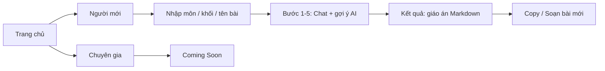

# Tổng hợp tính năng – AI Co-pilot STEAM

Tài liệu dùng để **trình bày** cho người khác về tool. Có thể copy nội dung dưới đây vào slide hoặc doc.

---

## 1. Tool là gì?

**AI Co-pilot STEAM** là **trợ lý soạn giảng STEAM thông minh dành cho giáo viên Vật lí**.

- **STEAM** = giáo dục STEAM (Science, Technology, Engineering, Arts, Mathematics), **không** phải nền tảng game Steam.
- Mục tiêu: giúp giáo viên soạn giáo án STEAM nhanh hơn, có cấu trúc (Design Thinking) và có gợi ý từ AI.

---

## 2. Tính năng chính

| Tính năng | Mô tả |
|-----------|--------|
| **Hướng dẫn từng bước** | Luồng soạn bài theo 5 bước Design Thinking: Thấu cảm → Xác định vấn đề → Ý tưởng STEAM → Tạo nguyên mẫu → Thử nghiệm. |
| **Gợi ý AI** | Ở mỗi bước, AI (Grok/Gemini) đưa ra gợi ý ngắn; giáo viên chọn gợi ý hoặc tự nhập. |
| **Tạo giáo án hoàn chỉnh** | Sau 5 bước, hệ thống sinh **giáo án dạng Markdown** (mục tiêu, chuẩn bị, các bước dạy). |
| **Lưu trữ** | Giáo án có thể lưu vào PostgreSQL (qua Prisma); hỗ trợ người dùng đăng nhập hoặc dùng guest (`guest@co-pilot-steam.local`). |
| **Hai chế độ (trang chủ)** | **Người mới**: dùng luồng Co-pilot (Design Thinking). **Chuyên gia**: dự kiến "tự soạn + AI đánh giá", hiện tại hiển thị "Coming Soon". |

---

## 3. Luồng sử dụng (UX)

- **Bước 0**: Nhập môn (Vật lí), khối lớp, tên bài → "Bắt đầu soạn giảng".
- **Bước 1–5**: Mỗi bước có câu hỏi + gợi ý AI (chip) + ô nhập; hoàn thành từng bước rồi chuyển bước.
- **Bước 6**: Xem giáo án Markdown, nút Copy và "Soạn bài mới".

---

## 4. Kiến trúc kỹ thuật

| Thành phần | Công nghệ |
|------------|-----------|
| **Frontend** | Vite, React 18, TypeScript, React Router, TanStack Query, shadcn-ui, Tailwind, Framer Motion, react-markdown. |
| **Backend** | Node.js, Express 5, TypeScript, Prisma (PostgreSQL). |
| **AI** | Groq (Grok, model `llama-3.1-8b-instant`) cho gợi ý và tạo giáo án; Gemini (gemini-1.5-flash) đã có trong code, có thể bật lại. |
| **Database** | PostgreSQL: bảng `User` (email, role), `LessonPlan` (subject, grade, lessonName, step1–step5, finalMarkdown, chatHistory, rating, isGoodCase…). |

**Kết nối**: UI chạy port 8080, proxy `/api` tới server (mặc định 3003). Luồng: Form → state AICoPilot → gọi API → hiển thị kết quả.

---

## 5. API chính

| Endpoint | Method | Chức năng |
|----------|--------|-----------|
| `/api/suggestions` | POST | Body: `lessonName`, `step` (1–5). Trả về danh sách gợi ý ngắn từ AI (hoặc mock). |
| `/api/generate-plan` | POST | Body: `lessonName`, `step1`–`step5`, tùy chọn `subject`, `grade`, `userEmail`. Trả về `markdown` và `lessonPlanId` (nếu lưu DB). |

Response chuẩn: `{ success: true, data }` hoặc `{ success: false, error: { code, message } }`.

---

## 6. Cấu trúc project (tóm tắt)

- **`server/`**: Express, config (env, constants), API routes, services (gợi ý, tạo giáo án), repositories (user, lesson-plan), Prisma.
- **`ui/`**: Vite SPA, trang Home, CoPilotPage (AICoPilot, StepForm, ChatInterface, FinalResult).
- **Root**: Scripts `npm run dev` (chạy đồng thời client + server), `npm run dev:server`, `npm run build` (build UI).

---

## 7. Tóm tắt 1 slide (elevator pitch)

**AI Co-pilot STEAM** giúp giáo viên Vật lí soạn giáo án STEAM nhanh hơn: đi theo 5 bước Design Thinking, mỗi bước có gợi ý AI, cuối cùng nhận giáo án Markdown và có thể lưu vào cơ sở dữ liệu. Hiện có luồng "Người mới"; luồng "Chuyên gia" (tự soạn + AI đánh giá) đang lên kế hoạch.

---

## Gợi ý khi trình bày

- Nhấn mạnh **đối tượng**: giáo viên Vật lí.
- Nhấn mạnh **giá trị**: có cấu trúc (Design Thinking), tiết kiệm thời gian nhờ gợi ý AI và giáo án tự sinh.
- Nếu cần demo: mở trang chủ → "Người mới" → đi qua 5 bước → xem giáo án và Copy.
- Có thể bổ sung: khảo sát năng lực STEAM (link Google Form trên trang chủ) trước khi dùng tool.
